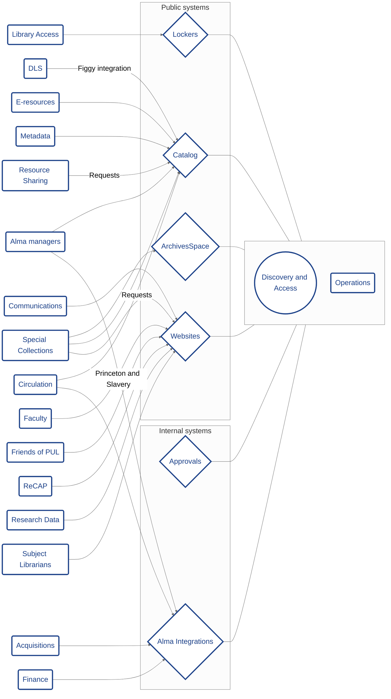

This graph shows our team's collaborations with other teams and stakeholders:

```mermaid
flowchart LR
%%{init: {'theme': 'neutral', 'themeVariables': { 'fontSize': '25px'}}}%%
    classDef default fill:#fff,stroke:#1d4289,color:#1d4289,stroke-width:4px;

    dacs((Discovery and Access))

    %% Collaborators
    access(Library Access)
    alma(Alma managers)
    acq(Acquisitions)
    circulation(Circulation)
    communications(Communications)
    dls(DLS)
    eresources(E-resources)
    faculty(Faculty)
    finance(Finance)
    fpul(Friends of PUL)
    metadata(Metadata)
    ops(Operations)
    recap(ReCAP)
    research(Research Data)
    resource(Resource Sharing)
    special(Special Collections)
    subject(Subject Librarians)


    %% Systems
    subgraph Internal systems
      approvals{Approvals}
      alma-integrations{Alma Integrations}
    end
    subgraph Public systems
      aspace{ArchivesSpace}
      catalog{Catalog}
      lockers{Lockers}
      websites{Websites}
    end
    subgraph IT[" "]
      dacs
      ops
    end

    %% Relationships
    access-->lockers

    lockers---IT
    catalog---IT
    aspace---IT
    websites---IT
    approvals---IT
    alma-integrations---IT

    special-->aspace

    alma-->catalog
    circulation--Requests-->catalog
    dls--Figgy integration-->catalog
    eresources-->catalog
    metadata-->catalog
    resource--Requests-->catalog
    special-->catalog


    communications-->websites
    faculty--Princeton and Slavery-->websites
    fpul-->websites
    recap-->websites
    research-->websites
    special-->websites
    subject-->websites
    
    alma-->alma-integrations
    acq-->alma-integrations
    circulation-->alma-integrations
    finance-->alma-integrations


```

