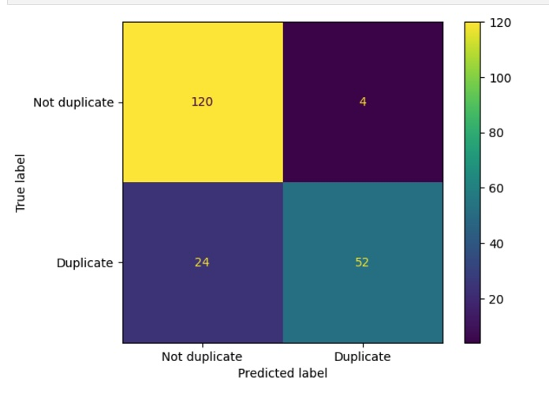
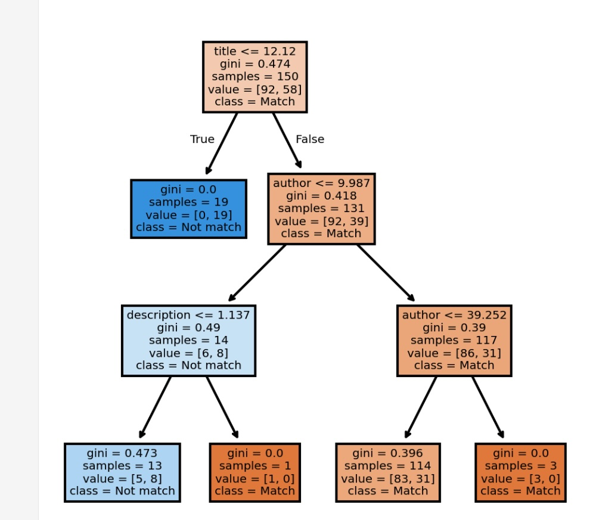
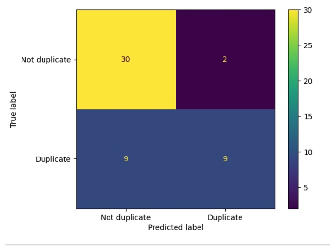

# Research: Using Machine Learning for Record Deduplication
## Introduction
Right now, the Catalog includes Princeton records from Alma and partner records from SCSB. There can be duplication between these collections, which can be confusing for users of the Catalog.

Can we identify when a SCSB record is a duplicate of a record in Alma using supervised or semi-supervised machine learning?

### Issues
#### Scalability
Right now, the library catalog has around 12 million records. Adding Yale's collections to ReCAP will add approximately 12 million more [check this number]. Any solution needs to be performant at that scale.

#### Process
The current process for getting records into the catalog is to first do a full index of dumps from the different sources (occurs approximate every 6 weeks), including Alma and SCSB. Next there are separate processes for Alma and SCSB to send daily incremental updates with updated records, new records, and deleted records. 

Deduplication would have to happen both at the point of the full index, and then somehow be handled with incremental updates. For example, what if we did not bring in a SCSB record because it was a duplicate of an Alma record, and then we received an update for that SCSB record? What if that update made it no longer a duplicate?

Also, since we re-start the ingest process every month, how could we leverage the expertise of our catalogers in a way that would persist across re-indexes? We wouldn't want to ask them to assess edge cases each time.

#### Decision point - false positives or false negatives?
When discussing mechanized deduplication, you have to make a decision between false positives and false negatives - that is, would you rather call something a duplicate that is not actually a duplicate (false positive), or miss a duplicate (false negative)?

Part of that decision is related to what you do with this information - if you are deaccessioning a physical book, and have a mission like Princeton's, you probably want to err on the side of keeping books that may be duplicates. 

If the deduplication is more ephemeral, it may be more acceptable to err on the side of calling more things duplicates that are not actually duplicates.

#### Transliterations
Right now, our example data does not have any transliterated or non-Roman script examples. Might have better matching if we match on the non-transliterated vernacular fields that are linked to the 245, like the goldrush_algorithm does.

## Methods
### Turning text into something models can handle
One mechanism that has been used for deduplicating text documents in the past is using applying a simhash to the text, sorting the resulting simhashes, and calculating the hamming distance between each adjacent simhash. The smaller the hamming distance, the more similar the texts are. This process is described in [the simhash algorithm](https://matpalm.com/resemblance/simhash/) by Mat Kelcey, and was originally developed by Moses Charikar, who described it in his paper ["Similarity Estimation Techniques from Rounding Algorithms"](https://www.cs.princeton.edu/courses/archive/spring04/cos598B/bib/CharikarEstim.pdf).

A plus of this approach over something like the Goldrush algorithm is that it can find near, but not exact, matches.

- Current issues I've noticed include:
  - In description, using 'p.' vs. 'pages' results in a large hamming distance
  - '&' vs. 'and' results in a large hamming distance

### Using the simhashes
My hope was that we could use machine learning to find the best thresholds for hamming distances to determine whether a record was a duplicate of another record based on hamming distance between titles, authors, description, etc.

I started by making a best guess of appropriate hamming distances by looking over the hamming distances between duplicates that were not completely the same, and then making small adjustments based on the algorithm's correct and incorrect guesses. 

I also found that by ordering the simhashes based on the features in a different order could have an impact on the results (e.g., sorting the hashes by `[hashed_title, hashed_author, hashed_publisher]` could end up with different duplicates from a sort by `[hashed_title, hashed_author, hashed_description]`), since different records would end up adjacent to each other.

After having done this exercise, I tried to see if I could find more accurate thresholds for difference using a decision tree based on data from the hamming distances (features) and whether a human determined the records were duplicates or not (target). 

## Conclusion
Comparison of scoring metrics for human-made thresholds for duplicates vs. the scoring for scki-kit learn's DecisionTree.

| Metric            | Human | Decision Tree |
| ----------------- | ------| ------------- |
| Accuracy          | 86%   | 78%           |
| Misclassification | 14%   | 22%           |
| Precision         | 93%   | 82%           |
| Sensitivity       | 68%   | 50%           |
| Specificity       | 97%   | 94%           |

### Human-made thresholds
Thresholds for hamming distance cut-offs, based on human intuition and experimenting.
#### Thresholds
- title_threshold = 0
- author_threshold = 9
- description_threshold = 25
- published_threshold = 25

#### Confusion Matrix

### Decision Tree
Thresholds for hamming distance cut-offs, based on sci-kit learn's decision tree model
#### Visualized tree

#### Confusion Matrix
The numbers for this matrix is much smaller, because it is only for those records in the test set, not the training set.

## Next Steps
It turns out that other people had the same idea, and there is a python library - [dedupe](https://github.com/dedupeio/dedupe) - that uses very similar approaches, but has had a lot more time to be refined. They have a good explanation of [how it works](https://dedupe.io/documentation/how-it-works). 

I created a [Jupyter notebook](https://jupyter.org/) using this library as a [proof of concept](https://github.com/pulibrary/dedupe_jupyter), and it was very successful.

Possible next steps would be:
1. See whether we could scale up using the Python dedupe library against Marc records. I have started a [python repository to prepare the data](https://github.com/pulibrary/pymarc_dedupe), based on the fields used for the GoldRush algorithm.
1. Recruit people to manually deduplicate a known set of records and compare their results and measure how much they agree
1. Train the dedupe algorithm with a portion of the human-generated sets and compare its performance with the rest of that human-generated set
1. Compare the performance of both the humans and the dedupe machine learning algorithm with the more manual GoldRush algorithm

## References
- Simhash - https://matpalm.com/resemblance/simhash/
- "Similarity Estimation Techniques from Rounding Algorithms" - https://www.cs.princeton.edu/courses/archive/spring04/cos598B/bib/CharikarEstim.pdf 
- Jaccard Similarity and Shingling - https://users.cs.utah.edu/~jeffp/teaching/cs5955/L4-Jaccard+Shingle.pdf
- Taking the Confusion out of Confusion Matrices - https://towardsdatascience.com/taking-the-confusion-out-of-confusion-matrices-c1ce054b3d3e 
- https://spotintelligence.com/2023/01/02/simhash/#How_to_use_SimHash_in_Python
- [Documentation on identifying duplicates for removal from CAMS](https://pul-confluence.atlassian.net/wiki/spaces/ALMA/pages/1770421/Guidelines+for+Identifying+and+Handling+Duplicates)
- Mark Zelesky's implementation of the Goldrush algorithm (Private repository) - https://github.com/PrincetonUniversityLibrary/lib_reports/blob/main/ruby/lib/ils_sql/goldrush_algorithm.rb 
- GoldRush Match Key description - https://coalliance.org/sites/default/files/GoldRush-Match_KeyJanuary2024_0.doc
- Wagner, G., (2024). BibDedupe: An Open-Source Python Library for Bibliographic Record Deduplication. Journal of Open Source Software, 9(97), 6318, https://doi.org/10.21105/joss.06318
  - This software library focuses on deduplication of journal articles for meta-analysis and research synthesis, not general bibliographic records, or records of monographs
  - Does not give sufficient weight to differing years for our purposes
- Dedupe python library https://github.com/dedupeio/dedupe 
